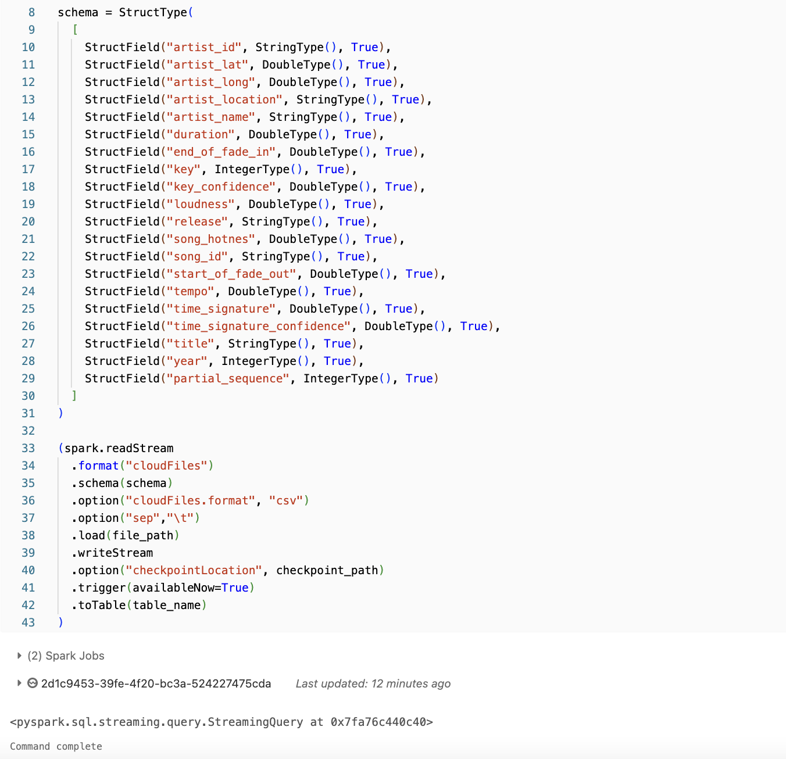
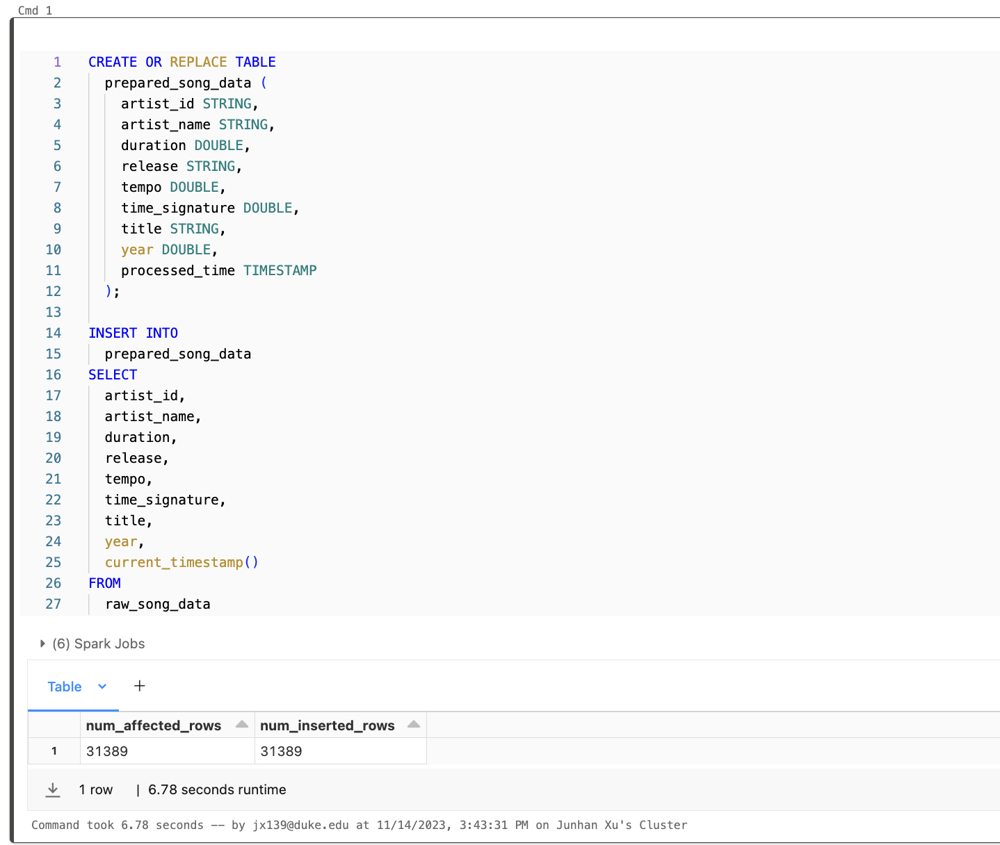
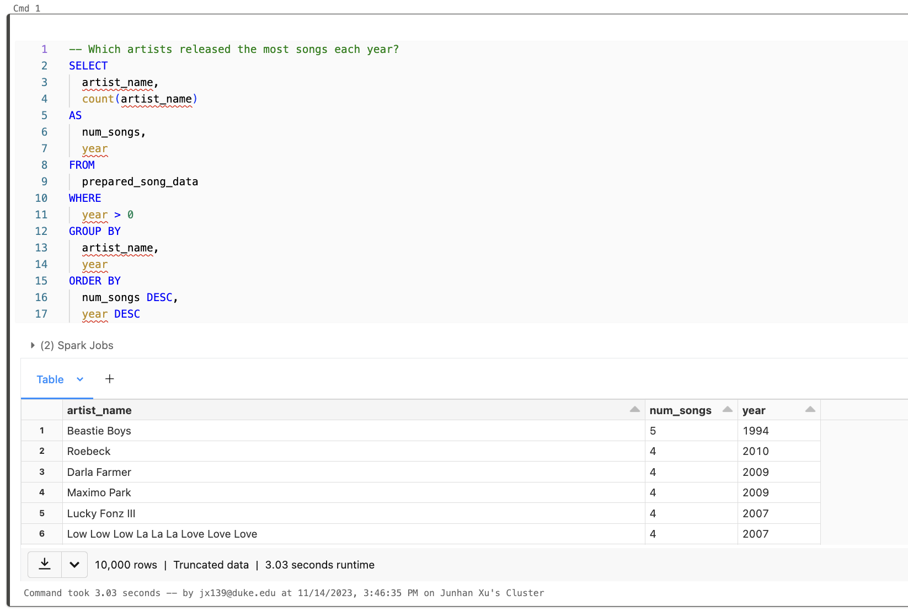
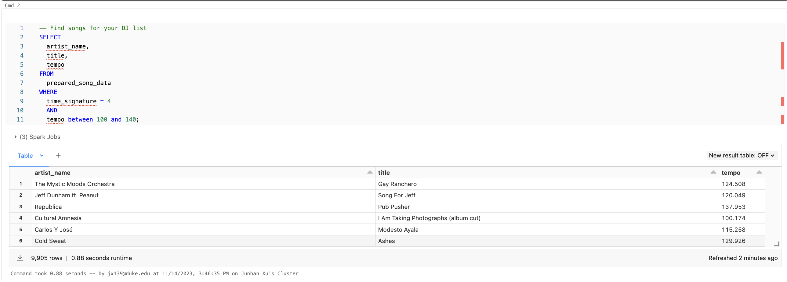
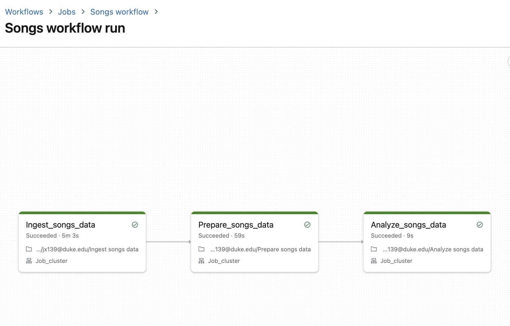

# IDS706-Week11-Mini-Project: Data Pipeline with Databricks

## Overview

This repository contains a Databricks data pipeline designed for processing and analyzing song data. The pipeline ingests data from a structured dataset, performs transformations, and stores the processed data for analysis. This allows for insightful queries into the music data, such as identifying popular artists and curating song lists based on certain criteria.

## Data Pipeline Function

The data pipeline performs the following functions:

- **Ingestion**: Reads a dataset of song metadata and features.
- **Transformation**: Processes and transforms the data to a more analysis-friendly format.
- **Storage**: Saves the transformed data for further analysis and querying.

## Data Source and Sink

### Data Source

- **Source Type**: Cloud File Storage (CSV format).
- **Location**: `/databricks-datasets/songs/data-001/`.
- **Schema**: The data includes fields such as `artist_id`, `artist_name`, `duration`, `release`, `tempo`, and others.

### Data Sink

- **Sink Type**: Databricks Managed Table.
- **Table Name**: `prepared_song_data`.
- **Storage Format**: The data is stored in a structured table format for easy querying and analysis.

## Data Source and Sink Configuration

### Source Configuration

- Data is read as a stream using Spark's structured streaming capabilities.
- Format: CSV, with tab (`\t`) as the separator.
- Schema: Defined explicitly in the pipeline to match the structure of the source data.

### Sink Configuration

- The data is written to a Databricks managed table.
- A checkpoint location is specified for fault tolerance in streaming (`/tmp/pipeline_get_started/_checkpoint/song_data`).
- Data is processed and stored in real-time, making it immediately available for querying upon ingestion.

## Analysis Queries

Two example queries are included to demonstrate the potential analyses:

1. **Artist Popularity by Year**: Identifies which artists released the most songs each year.
2. **DJ List Curation**: Finds songs that fit certain criteria (e.g., time signature and tempo range) suitable for a DJ list.

## Getting Started

To use this pipeline:

1. Ensure you have access to a Databricks workspace with the necessary permissions.
2. Clone this repository.
3. Import the notebooks into your Databricks workspace.
4. Configure the cluster and attach the notebooks to it.
5. Run the notebooks to establish the pipeline and perform analyses.
  
  

